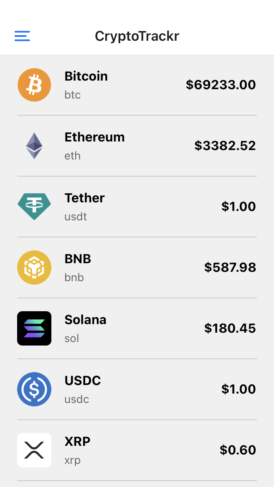
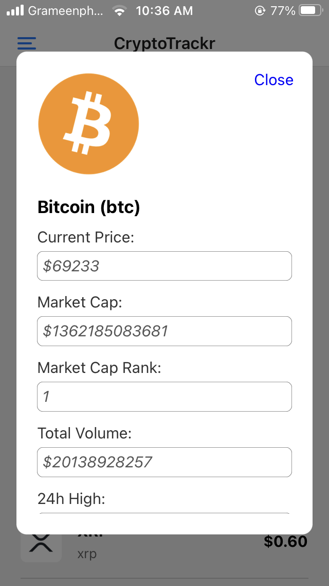
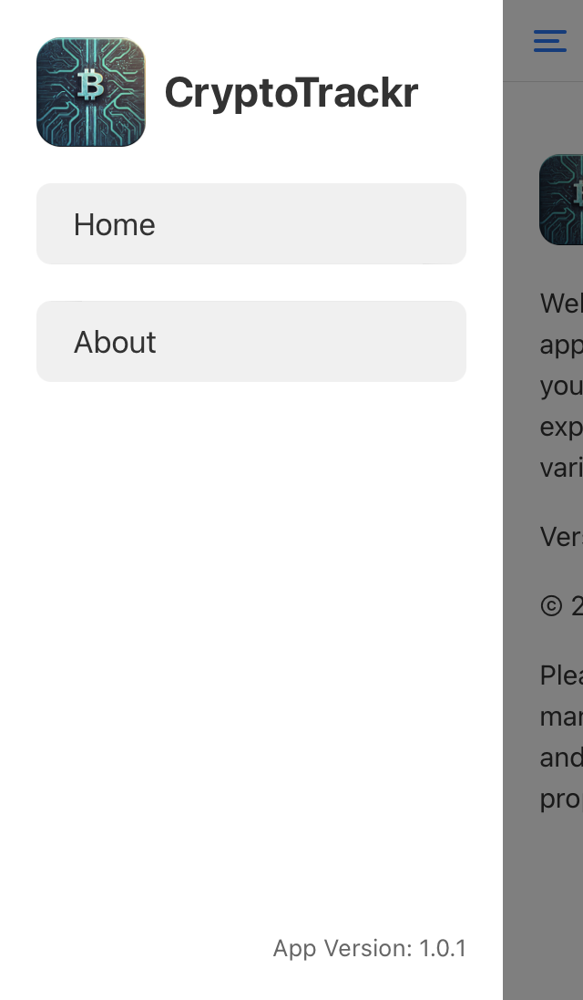
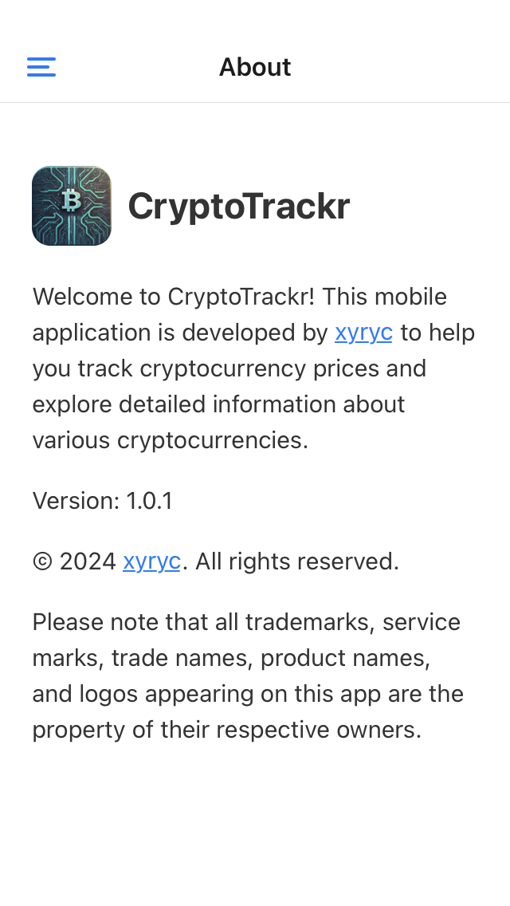

# CryptoTrackr

CryptoTrackr is a mobile application developed with React Native that allows users to track cryptocurrency prices and view detailed information about different cryptocurrencies.

## Features

- View live cryptocurrency prices
- Detailed information about each cryptocurrency
- Swipe down to refresh data
- Tap on a coin to view additional information in a modal

## Screenshots

  
  
  
  

<!-- Add more screenshots as needed -->

## Installation

To run this app locally, follow these steps:

1. Clone this repository: `git clone https://github.com/your-username/CryptoTrackr.git`
2. Navigate to the project directory: `cd CryptoTrackr`
3. Install dependencies: `npm install`
4. Run the app on iOS: `npx react-native run-ios`
5. Run the app on Android: `npx react-native run-android`

## Technologies Used

- React Native
- Axios
- Other dependencies...

## Contributing

Contributions are welcome! If you find any bugs or want to suggest new features, please open an issue or submit a pull request.

## Credits

- Developer: [Anik](https://github.com/duskdev17)
- API: [CoinGecko API](https://www.coingecko.com/api)

## License

This project is licensed under the [MIT License](LICENSE).
